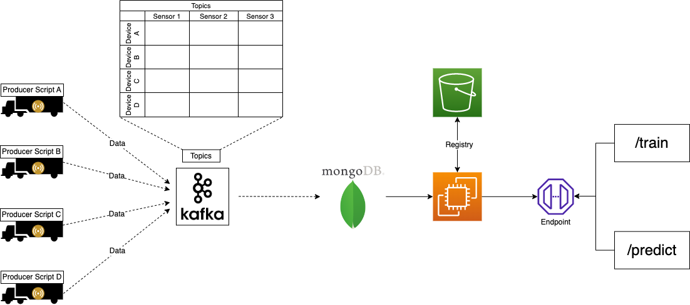

# **Sensor-fault-detection**

**Current project status:**

```diff
! In Progress
```

## Problem Statement

Modern heavy-duty vehicles utilize Air Pressure Systems (APS), which rely on compressed air instead of hydraulic systems to engage the brake pads. The key advantages of APS include the ease of obtaining compressed air and its long-term sustainability. However, APS-equipped brakes require a continuous supply of compressed air to remain disengaged and allow the vehicle to move. If, due to any unforeseen circumstances, this supply of pressurized air becomes compromised, the brakes fail to disengage, causing the truck to come to a halt. In such situations, truck owners are compelled to dispatch a repair vehicle to diagnose and rectify the malfunction. The challenge lies in the complexity of the APS, which spans both the truck and trailer and consists of an extensive network of pipes responsible for supplying air. This intricacy makes it exceedingly difficult to pinpoint whether the issue stems from the APS or another source. Consequently, fleet owners incur significant expenses in terms of time and money that could otherwise be saved.

Additionally, the APS is equipped with sensors that collect health data about the system. Early detection of APS-related faults could result in substantial time and cost savings by allowing for preemptive repairs. Conversely, if a fault is unrelated to the APS, substantial savings can still be achieved by avoiding unnecessary checkups, along with the associated time and costs. This focused approach allows resources to be channeled effectively to other critical components of the truck, enhancing overall operational efficiency.

- APS is integral to heavy-duty vehicle operation.
- Brake malfunctions stemming from APS issues result in downtime and repair costs.
- Identifying APS-related faults early can lead to substantial cost and time savings.

The Scania dataset encompasses a multitude of features that are used to predict the class of failure. The negative class denotes failures unrelated to the APS, while the positive class signifies failures attributed to the APS.

## Solution Proposed

Introducing a machine learning algorithm/system capable of predicting whether a truck fault is linked to the APS represents a substantial advancement, greatly benefiting all stakeholders by reducing downtime and minimizing breakdown-related expenses. The proposed solution seeks to tackle the challenge of cost minimization within the Air Pressure System (APS) of heavy-duty trucks. This project will employ a binary classification approach to differentiate between failures caused by specific APS components and those originating elsewhere. The primary focus will revolve around minimizing false predictions and, in turn, curbing financial expenditures associated with unnecessary repairs.

- Implementing a machine learning system for fault classification.
- Binary classification approach: APS-related failures vs. other failures.
- Priority on reducing false positive predictions to optimize cost savings.

## Tech Stack Used

1. Python
2. FastAPI
3. Machine learning algorithms
4. Docker
5. MongoDB

## Infrastructure Required.

1. AWS S3
2. AWS EC2
3. AWS ECR
4. Git Actions
5. Terraform

## Before Running the Project

Before we run the project, make sure that you are having MongoDB in your local system, with Compass since we are using MongoDB for data storage. You also need AWS account to access the service like S3, ECR and EC2 instances.

## Data Collections to Endpoints



### Data Collection

More information about data collection can be found [here](data_collection).

Data collection is done using Kafka and MongoDB.


## Project Archietecture


## Deployment Archietecture

Under Construction...

<!--
 -->

# Steps to run the project

- Step 1: Clone the repository

  ```bash
  git clone https://github.com/sverma1999/sensor-fault-detection.git
  ```

- Follow rest of steps for [data_collection](data_collection/README.md)
  - Data Collection also has [README.md](data_collection/README.md) file, which contains the steps to run the project, and closer look of the code flow.
- Follow rest of the steps for [sfd_project](sfd_project/README.md)
  - sfd_project also has [README.md](sfd_project/README.md) file, which contains the steps to run the project, and closer look of the code flow.

# Peek of the High Level Training Pipeline


<!-- ## Jump to References

[High Level Code flow chart](sfd_project/flowcharts/0_training_pipeline.png) -->
