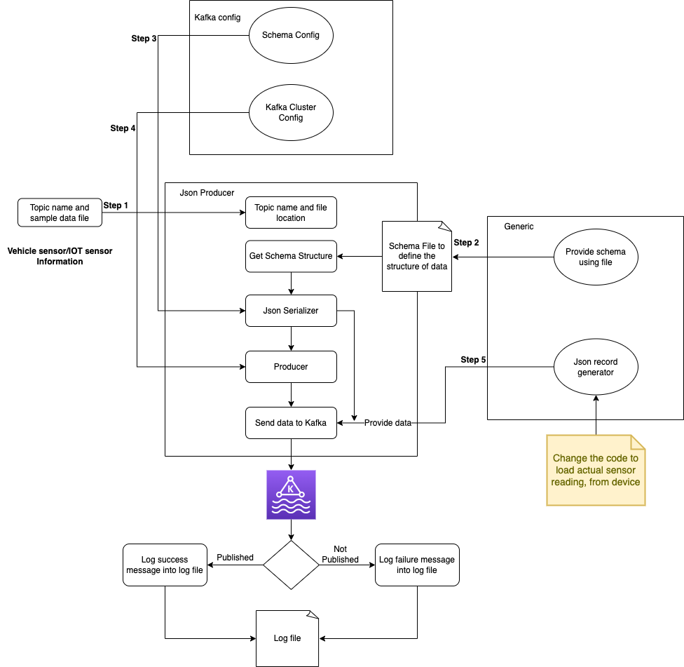
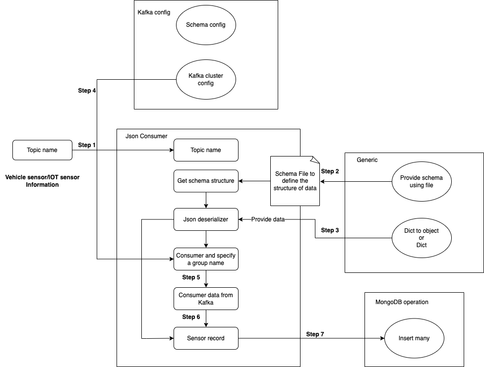
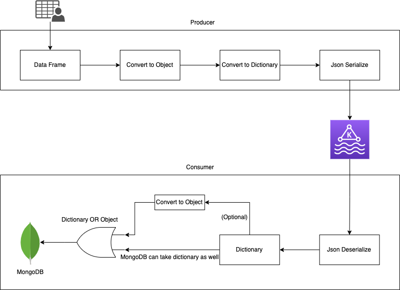

# Code flow

It s cruicial to understand the code flow of the producer and the consumer. The following diagram shows the code flow of the producer and the consumer.
Addionally, the data movement is also described in the following diagram.

## Producer

Each steps of the producer is described in the following diagram.

## Consumer

Each steps of the consumer is described in the following diagram.

# Data movement

Data moves from the producer to the consumer in the following way:

