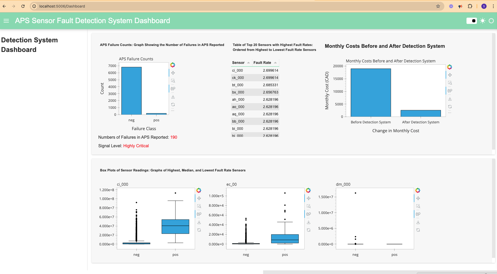

# Dashboard Using Panel

## Set up
### Install Panel
```bash
pip install panel hvplot jupyterlab jupyter_bokeh
```
### cd to the notebook directory
```bash
cd sensor-fault-detection/notebooks
```

### Run the below command to start the dashboard
```bash
panel serve Dashboard.ipynb
```

### Open the browser and go to the below `local` host to see the dashboard:
```bash
http://localhost:5006/Dashboard
```

### Dashboard would look like below:



There is one table and two plots in the dashboard.
 - First plot shows number of failure due to APS reported and how critical it is. 
 - Table shows the fault rates of sensors of APS Failure dataset.
 - Second plot shows cost analysis after using detection system.
 - Third plot shows the distribution of the low, medium, high faulty sensors.


