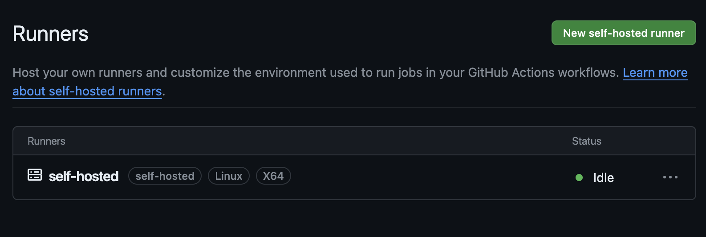

# Overview of deployment plan

Description: About the deployment

    1. Build docker image of the source code
    2. Push your docker image to ECR
    3. Launch Your EC2
    4. Pull Your image from ECR in EC2
    5. Lauch your docker image in EC2

# Install AWS CLI outside of the virtual environment:

- **Open new terminal, without activating virtual environment, and run:**

  ```bash
  pip install awscli --upgrade --user
  ```

- **Following command will show `aws` files added to the local path.**

  ```bash
  ls .local/bin
  ```

- **Export the path to the local path.**

  ```bash
  export PATH=$PATH:$HOME/.local/bin
  ```

- **Check if `aws` is added with some version.**

  ```bash
  aws --version
  ```

- **Output:**

  ```bash
  aws-cli/1.32.18 Python/3.10.9 Darwin/23.2.0 botocore/1.34.18
  ```

# AWS Access Key and Secret Key

- Go to AWS IAM
- Add user
- Give programmatic access
- Add permission policies:
  - AmazonS3FullAccess
  - AmazonEC2FullAccess
  - AmazonEC2ContainerRegistryFullAccess
- Click next and create user
- Add access key:
  - Click the user
  - Click security credentials
  - Click create access key
  - Select use case to be "Command Line Interface (CLI)"
  - Create access key
- Download the csv file

Follow this tutorial for more information: https://www.youtube.com/watch?v=HuE-QhrmE1c&t=252s

# Create AWS S3 bucket

- Go to AWS S3
- Create bucket
- Give name to bucket
- Select region
- Click create bucket
- Save bucket name in the constant `TRAINING_BUCKET_NAME`

Repeat same for prediction bucket and save the name in the constant `PREDICTION_BUCKET_NAME`

# Create AWS ECR repository

- Go to AWS ECR
- Click create repository
- Give name to repository
- Click create repository
- Save repository URI somewhere

# AWS EC2 instance

## Create EC2 instance

- Go to AWS EC2
- Click launch instance
- **Select Application and OS Images (you could choose others as well)**
  - Ubuntu Server 22.04 LTS (HVM), SSD Volume Type
- **Select an instance type**
  - I chose t2.small (you can try others too)
- **Key pair (login)**
  - Create a new key pair
  - Give name to key pair
  - Download the key pair
  - Save the key pair name somewhere
- **Network settings:**

  - Create new or use existing security group: I created new and saved the name somewhere.
  - Allowed SSH, HTTP, HTTPS, and IP from "anywhere".

- **Configure storage:** 16GB, General Purpose SSD (gp2)
- Launch instance

## Connect to EC2 instance

- Go to AWS EC2
- Click running instances
- Select the instance
- Click "connect"
- It would open new window with terminal
- Install docker in EC2 Machine, follow the commands below:
  - Update and upgrade (optional)
    ```bash
    sudo apt-get update -y
    sudo apt-get upgrade
    ```
  - Install docker (required)
    ```bash
      # download docker install script
      curl -fsSL https://get.docker.com -o get-docker.sh
      # run docker install script
      sudo sh get-docker.sh
      # add user to docker group, so that you don't have to use sudo everytime
      sudo usermod -aG docker ubuntu
      newgrp docker
    ```
- Keep the terminal open, we can set up self-hosted runner in this terminal.

## Configure EC2 as self-hosted runner (under construction)

- Go to GitHub repository of the project
- Go to `Settings`
- Go to `Actions`
- Click on `Runners`
- Click on `New self-hosted runner`
- You will see the instructions to configure the runner:
  - Runner image: Linux
  - Architecture: x64
  - Download: Copy 3-4 commands one by one and run in EC2 terminal
  - Configure: Copy the last command and run in EC2 terminal
- After running first command of configure, you will see the runner in the GitHub repository
  - Enter the name of the runner group to add this runner to: [press Enter for Default] = `Enter` and keep it empty
  - Enter a name for this runner: [press Enter for the default name] = Write `self-hosted` (also mentioned in `Using your self-hosted runner` section on GitHub)
  - Enter labels for this runner: [press Enter for none] = `Enter` and keep it empty
  - If any other runner exist with same name then it will ask to replace it, press `y` and `Enter`
  - Enter any additional labels (ex. label-1,label-2): [press Enter for none] = `Enter` and keep it empty
  - Enter the name of the work folder: [press Enter for _work] = `Enter` and keep it empty

- To start the runner, run the command:
  ```bash
  ./run.sh
  ```
  - It will start the runner and say `Listening for Jobs...`

  In GitHub repository, you will see the runner is active.
  

- Test Docker locally first, before running the workflow.


- To create GithHub workflow, follow the steps below:
  - Go to `.github/workflows` folder
  - Create a new file with `main.yml`
  - Write the workflow code
    - you will need to define name, on, jobs, steps, and run commands
    - jobs will be `continuous-integration` and `continuous-deployment`
    - Inside `continuous-integration`, you will need to define steps to checkout the code, configure AWS credentials, build the docker image, and push the image to ECR
    - Inside `continuous-deployment`, you will need to define steps to pull the image from ECR and run the docker image in EC2
    - You will need to define secrets in GitHub repository for AWS credentials
      - Go to GitHub repository > Settings > Secrets > Actions > New repository secret
      - Add AWS_ACCESS_KEY_ID, AWS_SECRET_ACCESS_KEY, AWS_DEFAULT_REGION, 
      ECR_URI, ECR_REPO_NAME, and ECR_REPO_TAG
  
  - Commit and push the code
  - Go to GitHub repository
  - Go to `Actions`
  - You will see the workflow running

