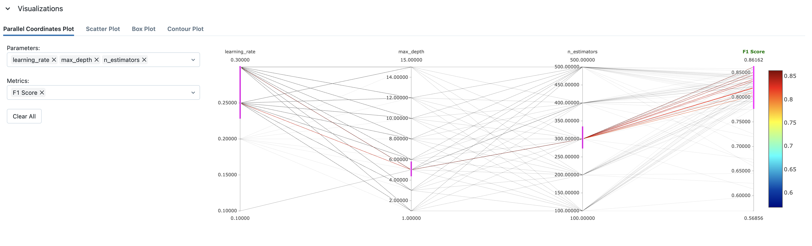

# Model Experimentation with MLFlow

In this project, I have used MLFlow to track the model's performance with different hyperparameters and model configurations.

# To run the model experiment with MLFlow, follow the below steps:

1. Install MLFlow by running the below command in the terminal:

```bash
pip install mlflow
```

2. Add the MLFlow code to the model evaluation code, which calls the trained model and evaluates the model's performance. In my case, MLFlow code is added in the `model_evaluation.py` file.

   - It should create new folder called `mlruns` in the project directory.

3. Run bash script `start_experiment.sh` to run the model experiment with MLFlow:

```bash
./start_experiment.sh
```

- This script run sxperiment for each combination of hyperparameters and model configurations. here is the snippet of the script:
  ```python
  learning_rates=(0.01 0.03 0.05 0.10 0.15 0.20 0.25 0.30)
  n_estimators=(100 200 300 400 500)
  max_depths=(1 3 5 6 8 10 12 15)
  ```

4. To see the mlfow flow experiment visuals, run the below command in the terminal to start the MLFlow server:

```bash
mlflow ui
```

5. Open the browser and go to the below `local` host to see the MLFlow experiment visuals:



Following parameters seams to be important for the `XGBoost` model:

```yaml
learning_rate: 0.3
n_estimators: 300
max_depth: 5
```

This gives us the model with following metrics:
  
  ```yaml
  Precision: 0.838
  Recall: 0.887
  F1 Score: 0.862
  ```


