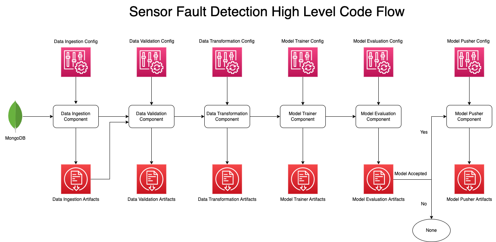
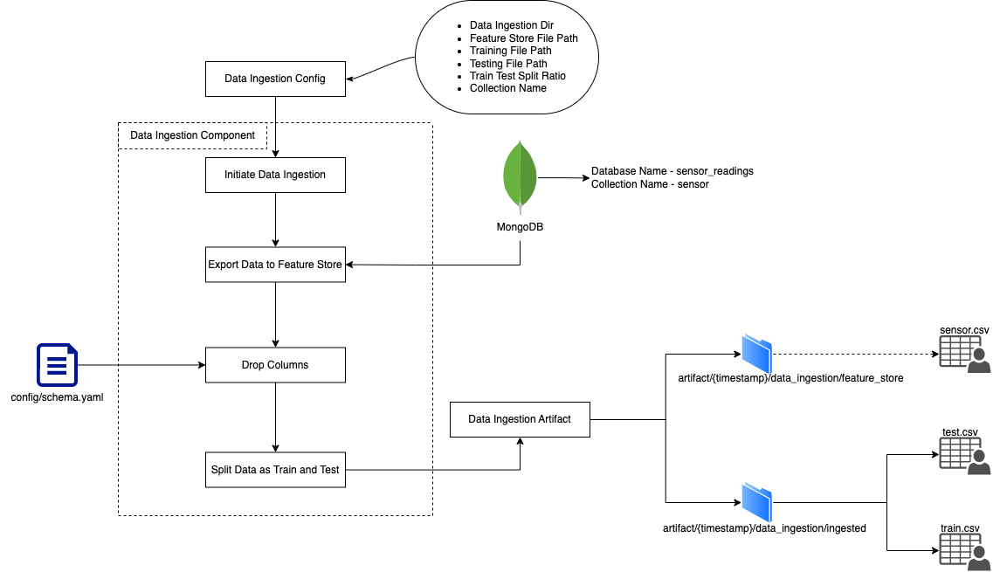

# For sfd_project folder

### Step 2- Create a conda environment after opening the repository

```bash
conda create -n sfdVenv python=3.8 -y
```

```bash
conda activate sfdVenv
```

### Step 3 - Install the requirements

```bash
pip install -r requirements.txt
```

### Step 4 - Export the environment variable

Create `.env` file in root of `sfd_project` folder and add environment variables in it:

```bash
AWS_ACCESS_KEY_ID=<AWS_ACCESS_KEY_ID>

AWS_SECRET_ACCESS_KEY=<AWS_SECRET_ACCESS_KEY>

AWS_DEFAULT_REGION=<AWS_DEFAULT_REGION>

MONGO_DB_URL="mongodb+srv://<username>:<password>@cluster0.nbka4hq.mongodb.net/test"
```

### Step 5 - Run the application server

```bash
python main.py
```

### Step 6. Train application

```bash
http://localhost:8080/train
```

### Step 7. Prediction application

```bash
http://localhost:8080/predict
```

## Important folders/files and their meanings

- **config:**
  - **schema.yaml:** This file contains the schema of the input data.
  - **model.yaml:**
- **docs:** This folder contains the documentation of the project in the form of images and markdown files.
- **flowcharts:** This folder contains the flowcharts of the project in the form of images.
- **sensor:** All the code related to the sensor project goes here.
  - **cloud_storage:** Code to manage files across cloud goes here.
  - **components:** For creating independent components of the project, such as data ingestion, data preprocessing, model training, model prediction etc...
  - **configuration:** To maintain the connections related configurations such s3 bucket connection, MongoDB connection.
  - **constant:** Things like file paths, s3 bucket names, database names, model names, environment variables, etc... will stay constant all through the project.
  - **data_access:** The code to get data from MongoDB goes here.
  - **entity:** Defines Structure for input and output of every machine learning component.
    - **artifact_entity:** Describes the output of the training components like data ingestion, data preprocessing etc...
    - **config_entity:** Describes the input configuration of the training components like data ingestion, data preprocessing etc...
  - **ml:** Any custom model, accuracy, loss, graph, feature engineering etc... goes here.
  - **pipeline:** Training and Prediction pipelines goes here.
  - **utils:** Folder to keep all the utility functions.
    - **main_utils.py:** Any simple functions that are used in multiple places goes here.
    - **exception.py:** To handle any abnormal errors.
    - **logger.py:** To keep record of what is happening inside the code.
- **venv(folder unavailable on Git):** Virtual environment for this project with Python==3.8.
- **main.py:** This is the main file to run the application.
- **requirements.txt:** This file lists all the required Python packages and their versions, making it easier to reproduce the project's environment and dependencies.
- **setup.py:** This file is used to define the project's metadata and dependencies, making it easier to distribute and install the project as a Python package.
  - This can be run as `python setup.py install` to install the project as a package.

# Code Flow

## High Level Code Flow of Training Pipeline



## Low Level Code Flow

### Data Ingestion



### Data Validation

Under Construction...

### Data Transformation

Under Construction...

### Model Training

Under Construction...

### Model Evaluation

Under Construction...

### Model Pusher

Under Construction...

## Acknowledgment

I learned about this project from a course at [Inuerons](https://ineuron.ai/).
