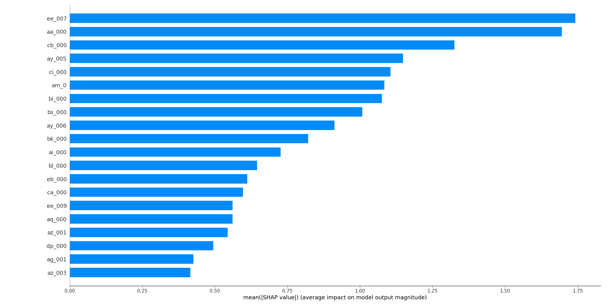
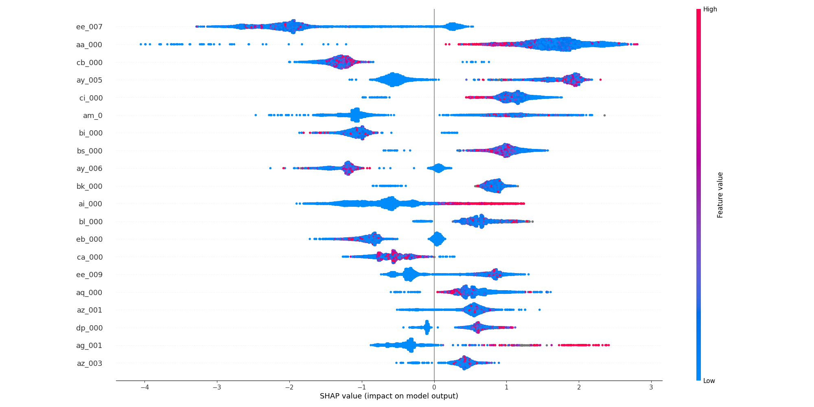
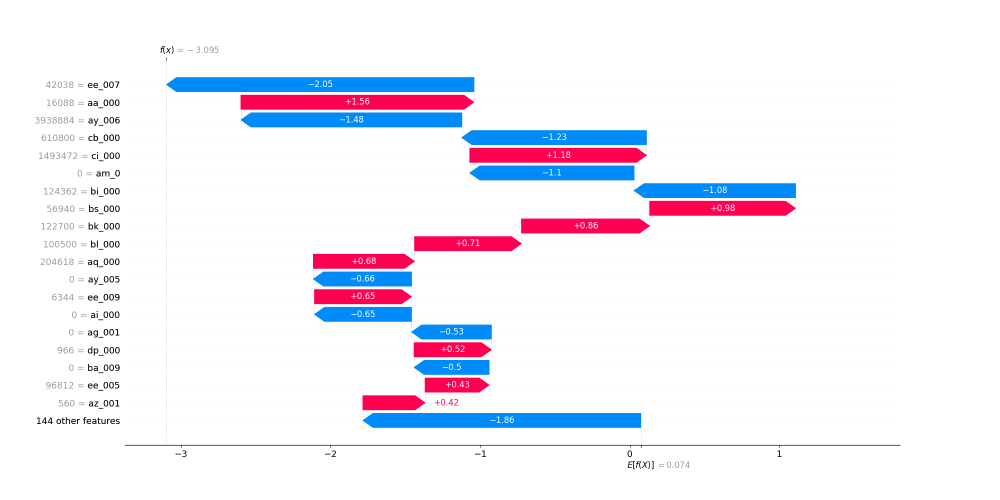

# Model Explanation

Model explanation is an important part of the model development process. It helps to understand the model's decision making process and also helps to debug the model. In this project, we have used SHAP (SHapley Additive exPlanations) to explain the model's decision making process. SHAP is a game theoretic approach to explain the output of any machine learning model. It connects optimal credit allocation with local explanations using the classic Shapley values from game theory and their related extensions.

## Interpreting Bar SHAP vizualization

- This plot shows the mean absolute SHAP value for each feature across all data points. This is a measure of the average impact of each feature on the model's output.
  - I have selected top 20 features for the plot.
- The features (sensors) are listed on the y-axis, with the length of the bar indicating the average impact. Longer bars mean the feature generally has a greater impact on model predictions.

- The bar plot is a good way to quickly see which features are most important to the model.
  - For instance, "ee_007" appears to be the most impactful feature.
  - "ag_001" and "az_oo3" has the least impact on the model's output as compared other top 18 features.

## Interpreting beeswarm SHAP vizualization

- The second image is a SHAP beeswarm plot. This plot provides a summary of the feature importance across the entire dataset.

- Each dot represents the SHAP value for a feature for an individual prediction. The color represents the value of the feature, with
  <code style="color : blue">blue</code> indicating <code style="color : blue">low</code> and <code style="color : red">red</code> indicating <code style="color : red">high</code> values.

- Features are stacked vertically to show distribution and density. You can see the range of impacts across the dataset for each feature, and you can also discern which features are generally more influential. There is option to turn this plot vertical, but I have kept it to default horizontal.

- The spread of the dots on the x-axis shows the range of the SHAP values for each feature. Features with a wide spread of dots have variable impacts on predictions depending on the specific sensor reading.
  - <code style="color : blue">Blue dots</code> on both sides might suggest complex behavior where the same low value of a feature can either increase or decrease the prediction depending on the context or the values of other features.
    - For example, "am_0" sensor might indicate a high likelihood of a fault under certain conditions but a low likelihood under others, even when the sensor's reading is low.
  - <code style="color : red">Red dots</code> on one side suggest that higher values of the feature have a more consistent effect on the prediction outcome.
    - For example, "ai_000" sensor might consistently increase the likelihood of a fault as its value increases.
    - Another example, "ay_006" sensor might consistently decrease the likelihood of a fault as its value increases.

## Interpreting Waterfall SHAP Visualization

- This plot starts with a base value, which is the average prediction of the model across all data points. In this case, the base value is shown as E[f(X)]=0.074.

- The bars represent the contribution of each feature to the prediction, with blue bars indicating a push towards a lower prediction value and red bars indicating a push towards a higher prediction value.

- The final value f(x) is the actual prediction for this particular instance, which in this case is -3.095. This suggests that the accumulated effect of the features led to a prediction that is significantly lower than the average model output.

- The features are listed on the y-axis, and you can see which features have the most substantial positive or negative influence on the prediction. For example, "ee_007" has a strong negative impact, while "aa_000" has a strong positive impact.
